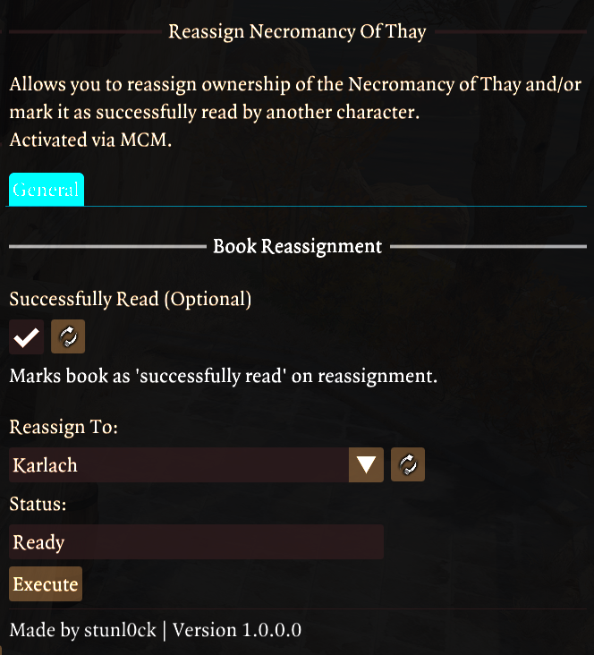
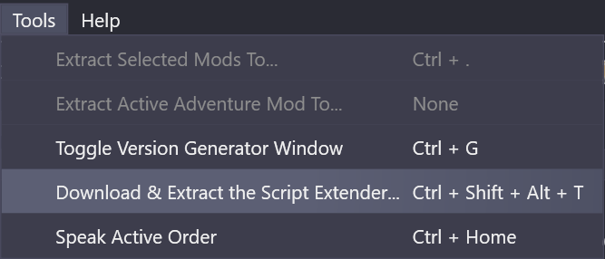

# Reassign Necromancy of Thay - BG3 Mod

Reassign **Necromancy of Thay** to a different character, marking it as successfully read. Requires **Mod Configuration Menu (MCM)**

### 🔄 How It Works  
- Access the mod via **MCM** in game
- **Book Reassignment Tab:**
    - Temporarily removes **Twisted Binding**  
    - Moves the book to your selected character  
    - Optionally marks it as **successfully read** to allow progression in the **Search the Cellar** Quest
- **Danse Macabre Tab:**
    - Allows adding or removing the **Danse Macabre** spell for selected characters.

### ⚠️ Important Notes
- **Tested in Act 3**:
  Before speaking to **Mystic Carrion**, the book was initially assigned to **Tav** and was successfully reassigned to **Karlach, Shadowheart, Astarion, Lae'zel, Jaheira, Gale, and Wyll**.
- **SAVE BEFORE USING:**  
  This mod has only been tested as described above. The **Necromancy of Thay** can be in many different states depending on your gameplay choices.
- **Cutoff Point:**  
  This mod **may not help** if you haven't fulfilled the book's requirements before the cutoff point in **Act 3**.
- **Conflicting mods:**  
  Make sure to temporarily disable any Inventory-sorting mods that can affect **Necromancy of Thay** (e.g., **Bags, Bags, Bags**, which auto sort books)

### 💾 Requirements
- **[BG3SE (Script Extender)](https://github.com/Norbyte/bg3se/releases/)**
  Can be installed via BG3MM:
    
- **[Mod Configuration Menu (MCM)](https://www.nexusmods.com/baldursgate3/mods/9162)**  

### 📖 Installation via BG3 Mod Manager  
1. Ensure **BG3SE** is installed.
2. Ensure **MCM** is set to **Active** in BG3MM.  
3. Download the mod **.zip** file.  
4. Drag the **.zip** file into the **Active Mods** section in BG3MM.  
5. Enable the mod in **BG3MM**.
6. Save and export your mod order list in **BG3MM**. 
7. You can remove the mod once you've reassigned and have confirmed

---

🔹 **Author:** stunl0ck  
🔹 **Version:** 1.1.0.0  
🔹 **Requires:** BG3SE, MCM  
